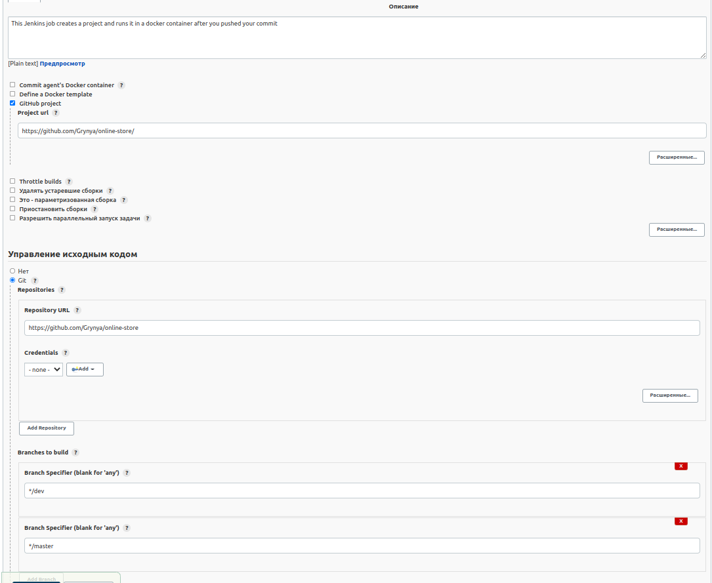
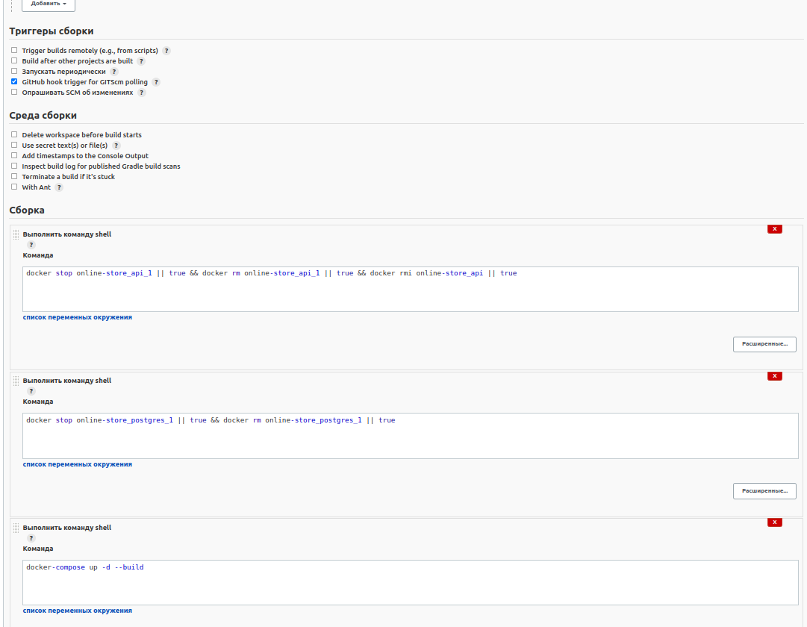
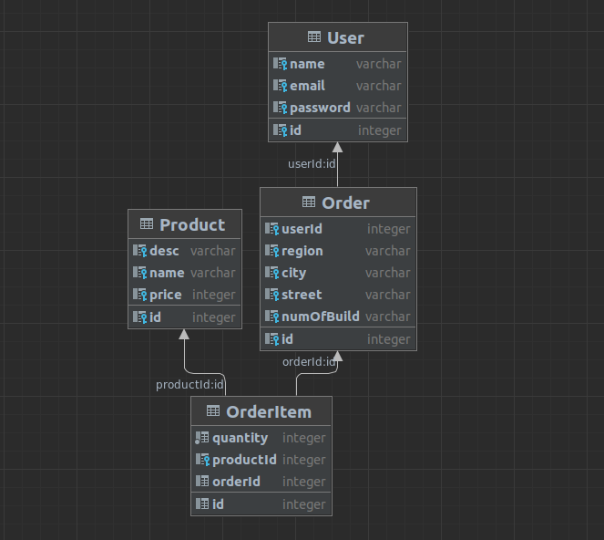

# Team members list
1. > Амброзяк Христина, ІА-93
2. > Гриненко Анастасія, ІА-93
3. > Михайлова Ілона, ІА-93

# The site name - Online-Store

### The purpose of project  
Create an online store website where you can buy goods.

### Features already added  
>Authorization/registration  
>Add product  
>Delete the product  
>Display a list of products   
>View products sorted by name or price  
>Make an order  
>Send feedback messages  
>Get all sent messages divided by its languages  

### Technologies  
> - <b>NestJS</b>  
> - <b>Docker & docker-compose</b> (Docker-compose file describes backend and database Postgres)  
> - <b>CI/CD</b> (using Jenkins and git hooks): create WebHook on Github. Run Jenkins in container from Dockerfile. created a 
> - <b>Jenkins Job</b> that runs the application with docker-compose and destroys the previous container if it exists.  
> - <b>RabbitMQ</b>, amqplib module (to connect to RabbitMQ) - was used to send messages from users to the queue, as well as to read messages and process them.
> Messages from this queue are read, then the service determines the language and returns messages divided by language 
> (ENG or UKR).

This is how Jenkins Job looks:

Database diagram:

